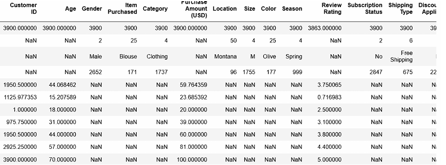
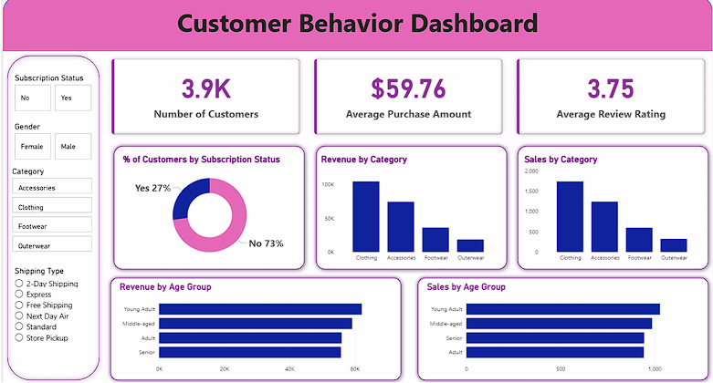

# 🛍️ Customer Shopping Trends Analysis | End-to-End Data Analytics Project

## 📌 Project Overview

This project simulates a real-world, corporate-level end-to-end Data Analytics workflow, demonstrating how raw retail data can be transformed into meaningful business insights.

### ⭐ STAR Method Approach

**🔹 Situation**  
Retail businesses generate massive amounts of customer transaction data but often struggle to extract actionable insights regarding customer behavior, purchase trends, and retention.

**🔹 Task**  
The objective was to analyze customer shopping patterns and build a complete analytics pipeline that enables better business decision-making.

**🔹 Action**  
- **Data Preparation & EDA (Python):**  
  Cleaned and transformed raw data, handled missing values, and performed exploratory data analysis to understand key patterns.

- **Data Analysis (SQL):**  
  Loaded structured data into a SQL database and executed queries to analyze customer segments, purchasing behavior, and trends.

- **Visualization (Power BI):**  
  Built an interactive dashboard to visually represent KPIs, trends, and actionable insights.

- **Reporting:**  
  Documented findings and provided business recommendations based on analysis.

**🔹 Result**  
Delivered a complete analytics solution that identifies customer behavior patterns, improves understanding of purchase drivers, and supports data-driven decision-making.

---

## 📊 Dataset Overview

The dataset contains customer shopping behavior across various dimensions:

**Columns:**

- Customer ID  
- Age  
- Gender  
- Item Purchased  
- Category  
- Purchase Amount (USD)  
- Location  
- Size  
- Color  
- Season  
- Review Rating  
- Subscription Status  
- Shipping Type  
- Discount Applied  
- Promo Code Used  
- Previous Purchases  
- Payment Method  
- Frequency of Purchases  

## 📷 Dataset Preview

---

## 🔄 Data Transformation & Workflow

### 1️⃣ Data Loading & Preparation
- Loaded dataset using Python (Pandas)
- Cleaned and preprocessed data
- Prepared structured dataset for SQL ingestion

### 2️⃣ Database Creation & Data Migration
- Created a database in SQL (MySQL/PostgreSQL/MS SQL Server)
- Loaded cleaned data into SQL database using Python

### 3️⃣ SQL Analysis
- Opened `customer_behavior_sql_queries.sql`
- Wrote and executed queries to answer key business questions:
  - Customer segmentation
  - Purchase behavior analysis
  - Revenue insights
  - Loyalty trends

### 4️⃣ Power BI Dashboard
- Connected SQL database to Power BI
- Opened `customer_behavior_dashboard.pbix`
- Built an interactive dashboard with:
  - Sales trends
  - Customer insights
  - Category performance
  - KPI tracking

---

## 📈 Key Features

- End-to-end analytics pipeline
- Real-world business problem simulation
- SQL-based analytical querying
- Interactive Power BI dashboard
- Data-driven insights and reporting

---

## 🛠️ Tech Stack

- **Python** (Pandas, NumPy, Matplotlib, Seaborn)
- **SQL** (MySQL/PostgreSQL/MS SQL Server)
- **Power BI**
- **Excel** (for initial exploration)

---

## 📌 Key Insights (Add Your Findings Here)

- Customers with subscriptions tend to have higher purchase frequency  
- Seasonal trends significantly impact product categories  
- Discounts and promo codes influence purchase behavior  
- Certain locations contribute higher revenue  

---

## 🚀 Conclusion

This project demonstrates the ability to handle the complete data analytics lifecycle — from raw data processing to delivering business insights through visualization and reporting.

---

## 📷 Dashboard Preview

---

## 📬 Contact

If you'd like to connect or discuss this project, feel free to reach out.
mail : akashphatangare4@gmail.com
